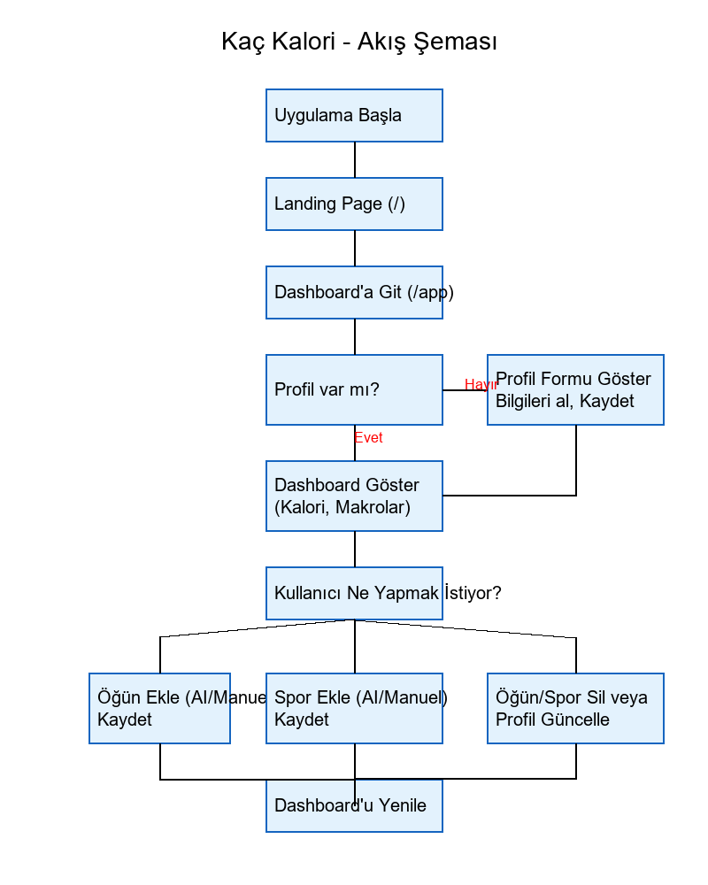

# Kaç Kalori - Final Projesi

Merhaba! Bu benim İleri Programlama dersi için hazırladığım final projem. Bu projede, kişilerin yaş, boy, kilo ve hareket seviyesine göre günlük kalori ihtiyacını hesaplayan ve gün içindeki yediklerini/sporlarını takip eden bir web uygulaması yaptım.

## Projeyi Geliştirme Sürecim (Neyi Kim Yaptı?)

Bu projeyi geliştirirken hem öğrendiğim Python bilgilerini kullandım hem de zorlandığım yerlerde Yapay Zeka (ChatGPT vs.) araçlarından destek aldım. Hangi kısımları benim, hangi kısımları yapay zekanın yaptığını aşağıda adım adım anlattım:

### 1. Benim Kendi Kodladığım Kısımlar (Arka Plan ve Mantık)
Projenin beyni ve mantığı tamamen bana ait. Şartnameye uygun olarak Nesne Yönelimli Programlama (OOP) yapılarını ben kurguladım.
- **Sınıfların (Class) Oluşturulması:** Kullanici, Ogun, Spor ve GunlukKayit class'larını ben yazdım. Özellikleri ve aralarındaki bağlantıları ben kurdum.
- **Veri Kaydetme İşlemleri:** Program kapandığında verilerin silinmemesi gerekiyordu. json ve os kütüphanelerini kullanarak verileri yerel JSON dosyalarına okuyup yazan kodları ben geliştirdim.
- **Matematiksel Algoritmalar:** İnsanın yaşına ve cinsiyetine göre Mifflin-St Jeor kalori hesaplama formülünü ve günlük toplam kalori hesaplarını kodlara ben entegre ettim.

### 2. Yapay Zekadan Yardım Aldığım Kısımlar (Görsellik ve AI Bağlantısı)
Bazı noktalarda, özellikle benim henüz tam uzmanlaşmadığım konularda, yapay zekaya kod yazdırarak projemi daha da güzelleştirdim.
- **Web Arayüzü (UI) Tasarımı:** Sitenin o güzel siyah/kırmızı görünümü, butonların şekilleri, açılır pencereler ve animasyonlar gibi HTML/CSS tasarım kodlarının tamamını Yapay Zekaya yazdırdım.
- **Gemini AI Bağlantısı (API):** Projeme ekstra bir özellik olarak "Google Gemini Yapay Zekasını" bağlamak istedim. Ancak API kodlarını yazmak karmaşık olduğu için google-generativeai kütüphanesini kullanarak yemeği analiz ettirme (Prompt atma ve JSON formatında cevap alma) kodlarını yine Yapay Zekadan yardım alarak yazdım.

## Projede Kullandığım Kütüphaneler
- Flask: Projeyi bir web sunucusu (site) olarak çalıştırmak için.
- google-generativeai: Gemini yapay zekasını sisteme bağlamak için.
- json: Verileri kaydetmek için.
- os: Dosya klasör yollarını belirlemek için.
- datetime: Öğün girilen saatleri alabilmek için.

## Uygulama Akış Şeması
Programın arkada nasıl çalıştığını gösteren akış şemamı aşağıya ekledim:

## Not
Projemi çalışır halde görmek için hiçbir şey indirmenize gerek yok. Doğrudan site üzerinden giriş yapıp test edebilirsiniz. 
*(Hocama Özel Not: Gemini yapay zekası ücretsiz versiyon olduğu için dakikada sadece 15 analiz yapmaya izin veriyor. Test ederken çok hızlı arka arkaya "Analiz Et" tuşuna basarsanız 1 dakika sizi engelleyebilir, bilginiz olsun!)*
